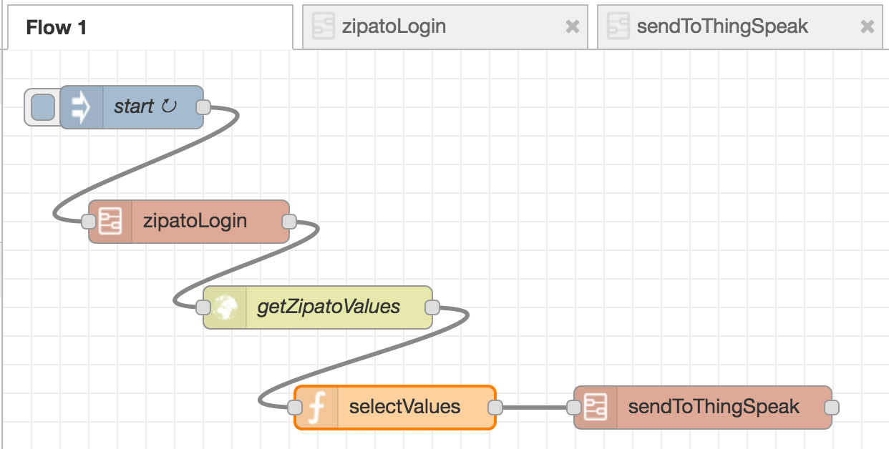
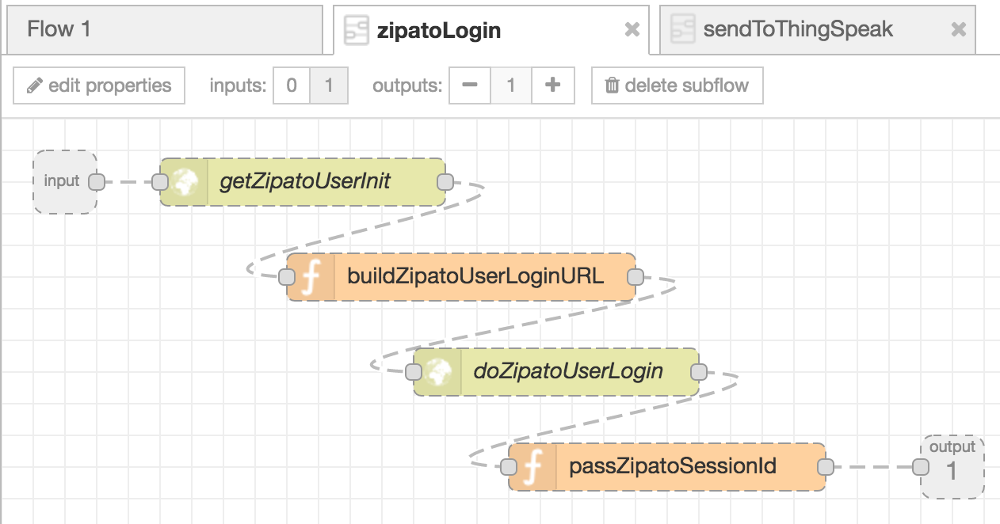
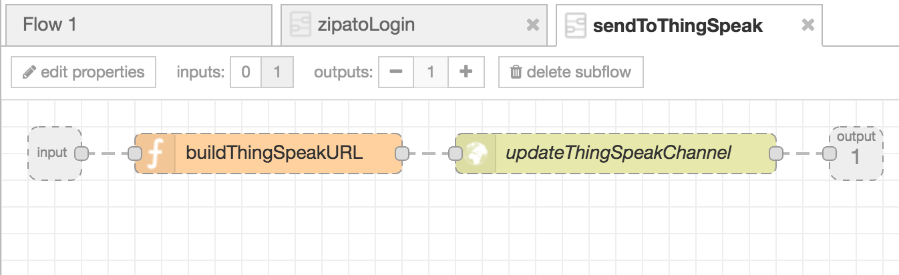

# ZipatoAPI_Node-RED
This project demonstrates how [Node-RED](http://nodered.org/) can be used to get device (sensor) readings through the REST API of the [Zipato home control and automation system](https://www.zipato.com/) and send them to a [ThingSpeak Channel](https://thingspeak.com/channels/144275) for visualization. 


## Prerequisites

1. An account at [my.zipato.com]() with an online Zipabox with some devices connected.

2. [Node.js](https://nodejs.org/en/download/) installed.

3. [Node-RED](http://nodered.org/) installed.

4. The [sha1 npm package](https://www.npmjs.com/package/sha1) installed.

   The 'require' keyword doesn't work within Node-RED function node so this has to be defined in the main `settings.js` file under the *functionGlobalContext* property like this: 

   ```javascript
   functionGlobalContext: {
       sha1:require('sha1')
   },
   ```

   The sha1 module can then be referenced within the Node-RED function node by using the following code:

   ```
   var sha1 = global.get('sha1');
   ```

   See the [Node-RED documentation on global-context](http://nodered.org/docs/writing-functions.html#global-context) for full details.

5. A [ThingSpeak](https://thingspeak.com/) account with a Channel configured to receive and visualize the values of selected Zipato devices (sensors).

   ​


## The main flow




The `getZipatoValues` http request node do a _GET /attributes/values_ against the [Zipato REST API](http://my.zipato.com:8080/zipato-web/api/) to get the  last values of <u>all</u> the devices (sensors).

The `selectValues` function node maps the UUID of a selected device (sensor) to a specific ThingSpeak field:

```javascript
...
for (i = 0; i < msg.payload.length; i++) { 
    switch (msg.payload[i].uuid) { 
    case "<sensor1 Zipato uuid>": // E.g. UUID of Aeon Labs ZW075-C16: CURRENT_CONSUMTION
        var msg1 = {payload: msg.payload[i].value};
        msg1.fieldAndValue = "field1=" + msg.payload[i].value.value;
        break;
    case "<sensor2 Zipato uuid>": // E.g. UUID of Aeon Labs ZW075-C16: CUMULATIVE_CONSUMPTION
        var msg2 = {payload: msg.payload[i].value};
        msg2.fieldAndValue = "field2=" + msg.payload[i].value.value;
        break;
    case "<sensor3 Zipato uuid>": // E.g. UUID of Aeon Labs ZW075-C16: AMPERES
        var msg3 = {payload: msg.payload[i].value};
        msg3.fieldAndValue = "field3=" + msg.payload[i].value.value;
        break;
    case "<sensor4 Zipato uuid>": // E.g. UUID of Aeon Labs ZW075-C16: VOLTAGE
        var msg4 = {payload: msg.payload[i].value};
        msg4.fieldAndValue = "field4=" + msg.payload[i].value.value;
        break;
    case "<sensor5 Zipato uuid>": // E.g. UUID of Zipato IR Extender: TEMPERATURE
        var msg5 = {payload: msg.payload[i].value};
        msg5.fieldAndValue = "field5=" + msg.payload[i].value.value;
        break;
    case "<sensor6 Zipato uuid>": // E.g. UUID of Aeon Labs DSB05: TEMPERATURE
        var msg6 = {payload: msg.payload[i].value};
        msg6.fieldAndValue = "field6=" + msg.payload[i].value.value;
        break;
    }
}
...
```

The UUID of a device (sensor) can be found by using the Device manager in the [My Zipato Dashboard](https://my.zipato.com/zipato-web/app2dashboard).


## ZipatoLogin sub flow

This sub flow does the necessary http requests and authorization settings to log in to My Zipato.

 

The `buildZipatoUserLoginURL` Function node do token encryption and builds the authorization URL:

```javascript
var sha1 = global.get('sha1');
var username = "<myZipatoUsername>";
var password = "<myZipatopassword>";
var nonce = msg.payload.nonce;
var jsessionid = msg.payload.jsessionid;
var token = sha1(nonce + sha1(password));
var url = "https://my.zipato.com:443/zipato-web/v2/user/login";

url = url + "?username=" + username + "&token=" + token + "&method=SHA1";

msg.url = url;
msg.headers.cookie = "JSESSIONID=" + jsessionid;

return msg;
```


## SendToThingSpeak sub flow

This sub flow builds the URL to be used in a _GET /update_ http request to update the ThingSpeak Channel Feed.



The fields values are passed to the `buildThinkSpeakURL`function node by the incoming `msg.fieldAndValue` property.

```javascript
var url = "https://api.thingspeak.com/update?api_key=<ThingSpeakChannelWriteAPIkey>&";

msg.url = url + msg.fieldsAndValues;

return msg;
```


## How to run the flow?##

Start the flow by running:`$node-red -u <path_to_flow> ZipatoAPI_Node-RED.json`

Then start the Node-RED editor at [http://localhost:1880](http://localhost:1880/)

(See the [node-RED documentation](http://nodered.org/docs/getting-started/running) for details)

Go through the function nodes and put in real data for username, password, sensor UUIDs, ThingSpeak Channel ID and Write API key.


# What next?#

This is a straightforward Node-RED flow primarily to demonstrate how this can be done. Next step should probably be to merge the flow and create a single configurable node that can be used to send Zipato device (sensor) readings to ThingSpeak.